### 🟪 About me

I build **AI-native systems, automation and software products**, focused on turning ideas into practical, production-ready systems.

Currently building **ASTRA Digital Factory** — an autonomous digital production system for research, planning, execution, verification and shipping.

---

### 🟪 My daily driver

---

### 🟪 Tech Stack

---

### 🟪 Languages & Tools I Have Placed My Hands On

---

### 🟪 Analytics

  

  

