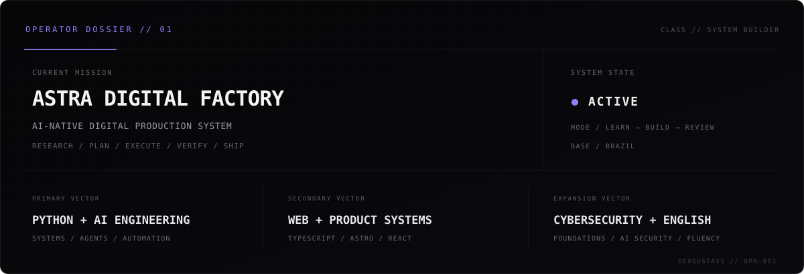
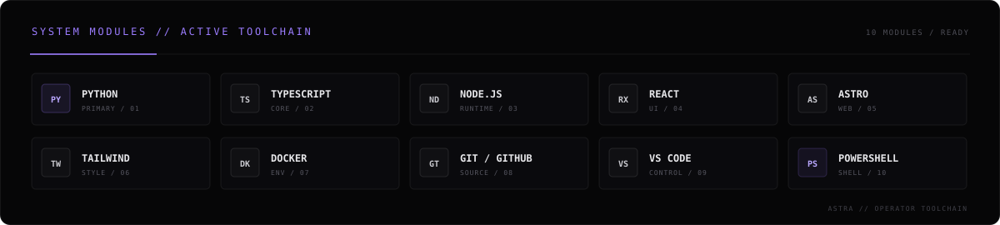

### `// ABOUT`

I build **AI-native systems, automation and software products**, focused on turning ideas into practical, production-ready systems.

Currently building **ASTRA Digital Factory** — an autonomous digital production system for research, planning, execution, verification and shipping.

 

  

  

  

  

  

<code>ASTRA // OPERATOR</code> &nbsp; BUILD SYSTEMS · VERIFY OUTPUT · SHIP RESULTS

